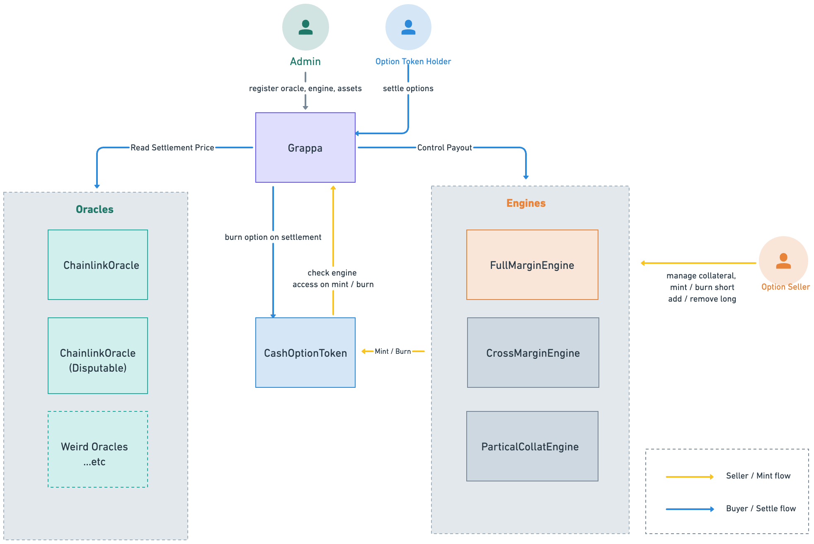

# Fully Collateralized Margin Engine

## High-Level Architecture

At its core, `FullMarginEngine` is a contract that is registered with `Grappa.sol` (as defined in the [cash core](!https://github.com/grappafinance/core-cash) repository) to act as a Margin Engine for minting option tokens.

Option sellers are expected to interact directly with `FullMarginEngine` to deposit collateral and mint option tokens. These tokens, which comply with the ERC1155 standard, can then be transferred and sold through protocols like Seaport, or other options AMMs.

As an option token holder, you do not necessarily need to be aware of `FullMarginEngine`. Instead, you can hold the tokens and go through `Grappa.sol` for settlement when a token expires in the money. During settlement, the Grappa contract authorizes `FullMarginEngine` to pay out the token. This ensures that the risks associated with each engine are fully isolated and handled individually.

## Fully Collateralized Engine

### Supported Tokens

As the name suggests, the fully collateralized engine requires sellers to deposit "full collateral" to mint an option. More specifically,
* To mint 1 call option token, you must deposit 1 underlying asset. (e.g., it requires 1 eth for 1 ETH-5000-CALL option)
* To mint 1 put option token, you must deposit the strike price amount of the strike asset. (e.g., it requires 5000 USDC for 1 ETH-5000-PUT option)

One unique feature of Grappa is its support for not just vanilla options, but also more complex payouts like "spreads":

#### 1. Call Spread

A [call spread](https://www.investopedia.com/terms/b/bullcallspread.asp) resembles a long call position, but its payout is capped at a certain value. This is equivalent to going long and short on 2 different options at 2 different strike prices:

* If I long a 2000-3000 ETH bull call spread, and ETH expires at price P, I receive a payout of `max(1000, max(P - 2000, 0))`.
* The seller of this 2000-3000 ETH bull call spread (e.g., holding a credit spread position), must collateralize this position with the max loss, which is 1000 USDC, or 0.5 ETH.
* Minting a call spread can be collateralized with either "USDC" or "ETH."

#### 2. Put Spread

Similarly, a [put spread](https://www.investopedia.com/terms/b/bearputspread.asp) uses the same strategy but in the other direction:

* If I long a 2000-1000 ETH bear put spread, and ETH expires at price P, I receive a payout of `max(1000, max(2000 - P), 0))`.
* The seller of this 2000-1000 ETH put spread must have 1000 USDC as collateral. Notice that it can only be collateralized with USDC because if ETH value drops close to zero, the seller still needs to payout but the collateral would be nearly worthless.

### Special Features

With `FullMarginEngine`, the seller has the freedom to mint a `CALL`, `PUT`, `CALL_SPREAD`, or `PUT_SPREAD` token. They can also transform their position from shorting a `CALL` to shorting a `CALL_SPREAD` via the `merge` function, or vice versa:

* `merge`: Combining 1 long option token with an existing short position allows for the removal of collateral.
* `split`: Splitting 1 existing "short + long" position into separate short and long tokens will require adding collateral to the engine.

In the `FullMarginAccount` struct, we use a field `tokenId` to keep track of the token you "created". Note that while you cannot create a spread **token** with negative payout (you cannot mint a call spread ERC1155 token with `2000-1000` strike), it is possible to first short a 2000 call, then buy another 1000 call from someone else, **merge** into the account, and remove all collateral. This is equivalent to "long 1000 call, short 2000 call" from the original seller's perspective. In this case, the `tokenId` in `FullMarginAccount` struct will contain an invalid ID to use through `Grappa` to request payout. Thus, we need to parse the two legs separately when dealing with "calculating payouts at settlement."

## Contract Guides

The `FullMarginEngine` inherits a lot of functionality from `BaseMargin` and `DebitSpread` contracts, which define the "shared flow" and common checks on each action, such as checking tokenId and handling the minting/burning of `CashOptionToken`. The unique parts implemented are:

1. The struct design and accounting for each sub-account in storage, which is defined in the `FullMarginLib` library.
2. The check to see if a sub-account is well-collateralized, which is defined in the `FullMarginMath` library.

### Sub Accounts

As designed in `BaseEngine`, each address can control up to 256 SubAccounts. The `subAccount` IDs are `address` types, but their last bytes (8-bits) differ from the address.

### Single Entry Point
All operations on a sub account can be batched into a single transaction using the `execute()` function as the entry point for a single sub-account. All actions directly change the state, and we always perform a health check at the end of any state-changing functions.
